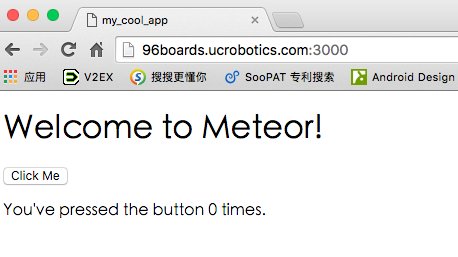
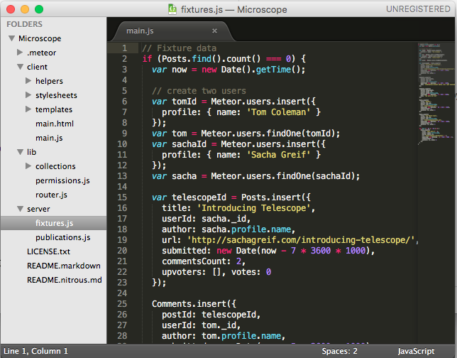
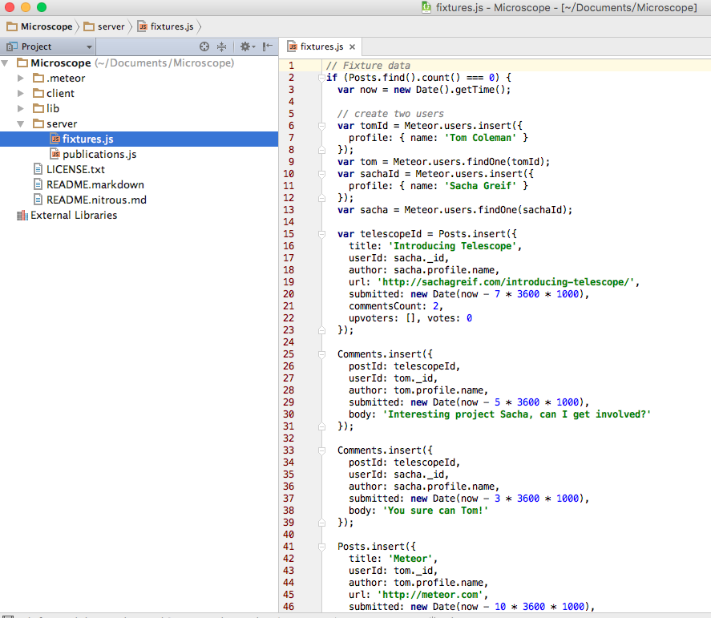
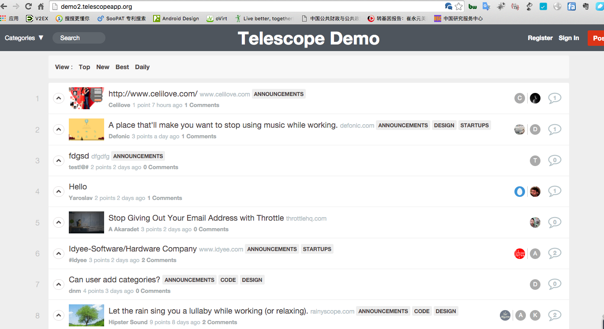
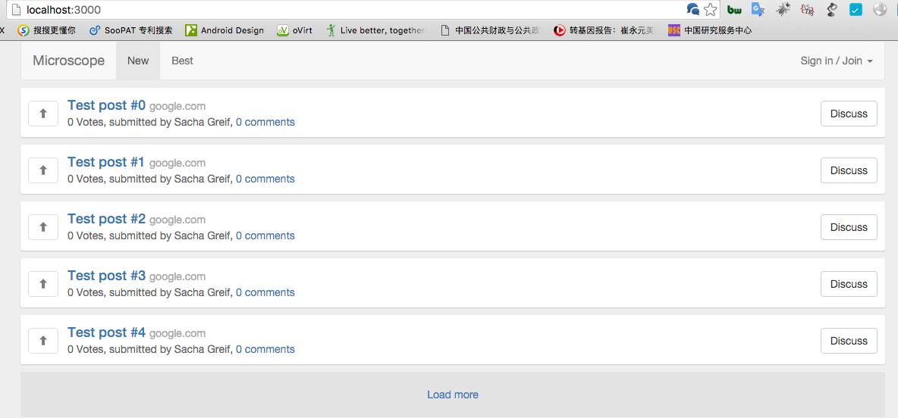

# 第零周周六

- 日期：20160116
- 地点：清华 FIT 一层小会议室
- 讲师：李明 & 田思源

## 预备知识

- Install Tools
  - Meteor
  - Chrome
  - Sublime Text/WebStorm
  - Git and Github

- Commands
  - meteor create/run/add/mongo/deploy/log
  - git init/add/commit/push/pull/log

- Basics
  - [HTML5](http://www.w3school.com.cn/html5/)
  - [CSS](http://www.w3school.com.cn/css/)/[LESS](http://less.bootcss.com/)
  - [JavaScript](http://www.w3school.com.cn/js/index.asp)

## 搭建开发环境

### 平台选择

- 首选 MacOS
- 次选 Linux（Ubuntu 14.04）
- 三选 Windows + Virtualbox + Ubuntu 14.04 虚拟镜像文件

		现场提供Ubuntu 安装 U盘

### 安装运行基本步骤

```
tsy@localhost:~$ curl https://install.meteor.com/ | sh

  % Total    % Received % Xferd  Average Speed   Time    Time     Time  Current
                                 Dload  Upload   Total   Spent    Left  Speed
100  6674    0  6674    0     0   3829      0 --:--:--  0:00:01 --:--:--  3829
Downloading Meteor distribution
######################################################################## 100.0%

Meteor 1.2.1 has been installed in your home directory (~/.meteor).
Writing a launcher script to /usr/local/bin/meteor for your convenience.
This may prompt for your password.

To get started fast:

  $ meteor create ~/my_cool_app
  $ cd ~/my_cool_app
  $ meteor

Or see the docs at:

  docs.meteor.com
  
tsy@localhost:~$ meteor create ~/my_cool_app
Created a new Meteor app in '/home/tsy/my_cool_app'.

To run your new app:                          
  cd /home/tsy/my_cool_app                    
  meteor                                      
                                              
If you are new to Meteor, try some of the learning resources here:
  https://www.meteor.com/learn                  

tsy@localhost:~$ cd ~/my_cool_app             
tsy@localhost:~/my_cool_app$ meteor
[[[[[ ~/my_cool_app ]]]]]                     

=> Started proxy.                             
=> Started MongoDB.                           
=> Started your app.                          

=> App running at: http://localhost:3000/

tsy@localhost:~/my_cool_app$ ls -l
total 12
-rw-rw-r-- 1 tsy tsy  31 Jan 16 04:43 my_cool_app.css
-rw-rw-r-- 1 tsy tsy 224 Jan 16 04:43 my_cool_app.html
-rw-rw-r-- 1 tsy tsy 478 Jan 16 04:43 my_cool_app.js

``` 



### 基本命令

```
tsy@localhost:~/Microscope$ meteor help
Usage: meteor [--release <release>] [--help] <command> [args]
       meteor help <command>
       meteor [--version] [--arch]

With no arguments, 'meteor' runs the project in the current
directory in local development mode. You can run it from the root
directory of the project or from any subdirectory.

Use 'meteor create <path>' to create a new Meteor project.

Commands:
   run                [default] Run this project in local development mode.
   debug              Run the project, but suspend the server process for debugging.
   create             Create a new project.
   update             Upgrade this project's dependencies to their latest versions.
   add                Add a package to this project.
   remove             Remove a package from this project.
   list               List the packages explicitly used by your project.
   add-platform       Add a platform to this project.
   remove-platform    Remove a platform from this project.
   list-platforms     List the platforms added to your project.
   build              Build this project for all platforms.
   lint               Build this project and run the linters printing all errors and warnings.
   shell              Launch a Node REPL for interactively evaluating server-side code.
   mongo              Connect to the Mongo database for the specified site.
   reset              Reset the project state. Erases the local database.
   deploy             Deploy this project to Meteor.
   logs               Show logs for specified site.
   authorized         View or change authorized users and organizations for a site.
   claim              Claim a site deployed with an old Meteor version.
   login              Log in to your Meteor developer account.
   logout             Log out of your Meteor developer account.
   whoami             Prints the username of your Meteor developer account.
   test-packages      Test one or more packages.
   admin              Administrative commands.
   list-sites         List sites for which you are authorized.
   publish-release    Publish a new meteor release to the package server.
   publish            Publish a new version of a package to the package server.
   publish-for-arch   Builds an already-published package for a new platform.
   search             Search through the package server database.
   show               Show detailed information about a release or package.

See 'meteor help <command>' for details on a command.

```

#### meteor update

```
tsy@localhost:~/Microscope$ meteor update
                                              
Changes to your project's package version selections from updating the release:
                                              
accounts-base           upgraded from 1.2.1 to 1.2.2
accounts-password       upgraded from 1.1.3 to 1.1.4
autoupdate              upgraded from 1.2.3 to 1.2.4
check                   upgraded from 1.0.6 to 1.1.0
ddp-common              upgraded from 1.2.1 to 1.2.2
ddp-server              upgraded from 1.2.1 to 1.2.2
ecmascript              upgraded from 0.1.5 to 0.1.6
ecmascript-collections  removed from your project
ecmascript-runtime      added, version 0.2.6
email                   upgraded from 1.0.7 to 1.0.8
es5-shim                upgraded from 4.1.13 to 4.1.14
meteor                  upgraded from 1.1.9 to 1.1.10
mongo                   upgraded from 1.1.2 to 1.1.3
promise                 upgraded from 0.5.0 to 0.5.1
random                  upgraded from 1.0.4 to 1.0.5
reactive-dict           upgraded from 1.1.2 to 1.1.3
standard-minifiers      upgraded from 1.0.1 to 1.0.2
stylus                  upgraded from 2.511.0_2 to 2.511.1
templating              upgraded from 1.1.4 to 1.1.5
webapp                  upgraded from 1.2.2 to 1.2.3

Microscope: updated to Meteor 1.2.1.          
                                              
Changes to your project's package version selections from updating package versions:
                                              
ian:accounts-ui-bootstrap-3  upgraded from 1.2.83 to 1.2.84
twbs:bootstrap               upgraded from 3.3.5 to 3.3.6
```

#### meteor mongo

```
tsy@localhost:~/Microscope$ meteor mongo
MongoDB shell version: 2.6.7
connecting to: 127.0.0.1:3001/meteor
Welcome to the MongoDB shell.
For interactive help, type "help".
For more comprehensive documentation, see
	http://docs.mongodb.org/
Questions? Try the support group
	http://groups.google.com/group/mongodb-user
meteor:PRIMARY> help
	db.help()                    help on db methods
	db.mycoll.help()             help on collection methods
	sh.help()                    sharding helpers
	rs.help()                    replica set helpers
	help admin                   administrative help
	help connect                 connecting to a db help
	help keys                    key shortcuts
	help misc                    misc things to know
	help mr                      mapreduce

	show dbs                     show database names
	show collections             show collections in current database
	show users                   show users in current database
	show profile                 show most recent system.profile entries with time >= 1ms
	show logs                    show the accessible logger names
	show log [name]              prints out the last segment of log in memory, 'global' is default
	use <db_name>                set current database
	db.foo.find()                list objects in collection foo
	db.foo.find( { a : 1 } )     list objects in foo where a == 1
	it                           result of the last line evaluated; use to further iterate
	DBQuery.shellBatchSize = x   set default number of items to display on shell
	exit                         quit the mongo shell
meteor:PRIMARY> 
```

#### meteor deploy

```
tsy@localhost:~/Microscope$ meteor deploy maodou-class
To instantly deploy your app on a free testing server, just enter your email address!
                                              
Email: tiansiyuan@gmail.com
                                              
Logging in as tiansiyuan.
Password:                                     
Deploying to maodou-class.meteor.com.         
Now serving at http://maodou-class.meteor.com 
```

### 编辑器

##### Sublime



#### WebStorm



## 代码分析：Microscope

### Telescope



### Microscope

我们将构建的应用是一个简化版的社交新闻网站，类似 Hacker News 或 Reddit，称为 Microscope（借鉴 基于 Meteor 的开源应用 Telescope），在课程中，解决构建 Meteor 应用需要的各种要素，例如用户账户、Collection、路由等等，后续会逐步讲到。




```
tsy@localhost:~/Microscope$ tree .
.
├── client
│   ├── helpers
│   │   ├── config.js
│   │   ├── errors.js
│   │   └── handlebars.js
│   ├── main.html
│   ├── main.js
│   ├── stylesheets
│   │   └── style.css
│   └── templates
│       ├── application
│       │   ├── layout.html
│       │   ├── layout.js
│       │   └── not_found.html
│       ├── comments
│       │   ├── comment_item.html
│       │   ├── comment_item.js
│       │   ├── comment_submit.html
│       │   └── comment_submit.js
│       ├── includes
│       │   ├── access_denied.html
│       │   ├── errors.html
│       │   ├── errors.js
│       │   ├── header.html
│       │   ├── header.js
│       │   └── loading.html
│       ├── notifications
│       │   ├── notifications.html
│       │   └── notifications.js
│       └── posts
│           ├── post_edit.html
│           ├── post_edit.js
│           ├── post_item.html
│           ├── post_item.js
│           ├── post_page.html
│           ├── post_page.js
│           ├── posts_list.html
│           ├── posts_list.js
│           ├── post_submit.html
│           └── post_submit.js
├── lib
│   ├── collections
│   │   ├── comments.js
│   │   ├── notifications.js
│   │   └── posts.js
│   ├── permissions.js
│   └── router.js
├── LICENSE.txt
├── README.markdown
├── README.nitrous.md
└── server
    ├── fixtures.js
    └── publications.js

12 directories, 41 files
tsy@localhost:~/Microscope$ 

```